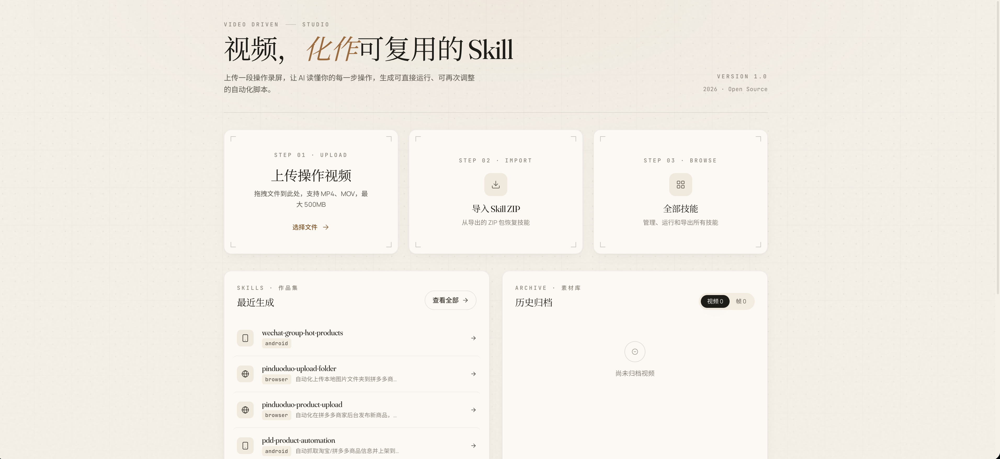
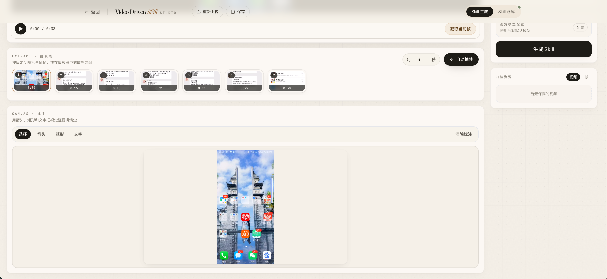
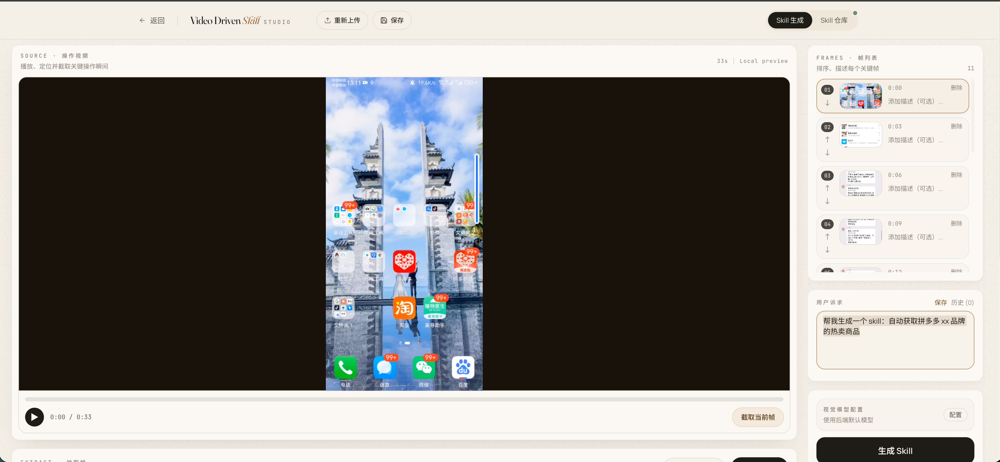
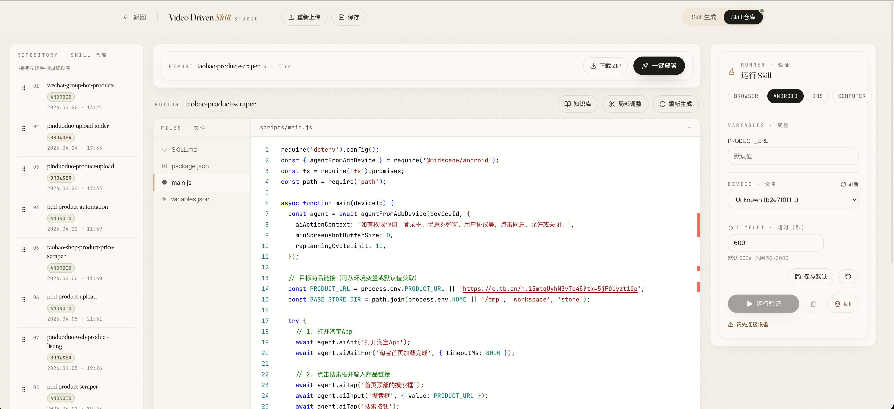

<p align="center">
  
</p>

<h1 align="center">Video Driven Skill</h1>

<p align="center">
  <strong>Turn operation recordings into reusable automation skills.</strong>
</p>

<p align="center">
  <a href="#quick-start">Quick Start</a> · <a href="#features">Features</a> · <a href="#screenshots">Screenshots</a> · <a href="#architecture">Architecture</a> · <a href="#license">License</a>
</p>

<p align="center">
  
  
  
  
  
  
  
</p>

---

## Overview

Video Driven Skill is an open-source automation studio that transforms **screen recordings** into **runnable, editable skill packages**. Upload a video, extract key frames, annotate intent, let a multimodal AI model draft the skill — then refine, run, version, archive, and export it.

The project is designed for teams and individuals who want automation to start from **how work is actually performed**, not from a blank script editor.

> **Workflow:** Record the process → Pick the frames that matter → Annotate intent → Generate a skill → Review & run → Export & deploy

---

## Features

- **Video-to-Skill Pipeline** — Upload an operation recording and automatically convert it into a structured skill package with `SKILL.md`, `package.json`, scripts, and variables.
- **Smart Frame Extraction** — Auto-extract key frames via FFmpeg, or manually capture the moments that matter.
- **Visual Annotation** — Mark up frames with arrows, notes, and corrections to tell the AI exactly what to do.
- **Multimodal AI Generation** — Leverages any OpenAI-compatible vision model to generate browser, Android, iOS, or desktop automation code.
- **In-Browser Code Editor** — Review, edit, and refine generated code with syntax highlighting and variable management.
- **Incremental Regeneration** — Regenerate the full skill or just a selected code range, with diff review between versions.
- **Local Skill Runner** — Run skills directly with streamed logs and optional screenshots.
- **Skill Repository** — Browse, search, import, export (ZIP), and drag-to-reorder your skill collection.
- **Knowledge Base** — Attach reference images, documents, and notes to each skill for richer context.
- **Archive System** — Preserve videos, frames, and requirements for building future skills from past material.

---

## Screenshots

### Home Dashboard

The entry point for uploading videos, importing skills, and accessing recent resources.

<p align="center">
  
</p>

### Frame Extraction

Automatically extract key frames from uploaded videos, or manually pick the moments that matter.

<p align="center">
  
</p>

### AI Skill Generation

Annotate frames with intent, configure generation parameters, and let the AI produce a complete automation skill.

<p align="center">
  
</p>

### Skill Repository

Browse, manage, and organize all your generated skills in one place.

<p align="center">
  
</p>

---

## Quick Start

### Prerequisites

- **Java 17+**
- **Maven 3.8+**
- **Node.js 18+** & npm 9+
- **FFmpeg** (available on `PATH`)
- An **OpenAI-compatible multimodal API** key

Install FFmpeg:

```bash
# macOS
brew install ffmpeg

# Ubuntu / Debian
sudo apt-get update && sudo apt-get install ffmpeg
```

### 1. Clone the Repository

```bash
git clone https://github.com/ingorewho/video-driven-skill.git
cd video-driven-skill
```

### 2. Configure Environment

```bash
cp .env.example .env
```

Edit `.env` with your API credentials:

```bash
export AI_API_KEY="your_api_key"
# Optional overrides:
export AI_BASE_URL="https://api.openai.com/v1"
export AI_MODEL="gpt-4o-mini"
```

### 3. Start the Application

Using the helper script:

```bash
./start.sh
```

Or start services manually:

```bash
# Backend (port 8080)
cd backend
AI_API_KEY="your_api_key" mvn spring-boot:run

# Frontend (port 3000)
cd frontend
npm install
npm run dev
```

### 4. Open in Browser

```
http://localhost:3000
```

---

## Typical Workflow

1. **Upload** — Upload an operation recording (e.g., a screen capture of a workflow).
2. **Extract Frames** — Auto-extract key frames or manually capture the moments that matter.
3. **Annotate** — Mark up frames with arrows, notes, and corrections.
4. **Describe Intent** — Tell the AI what you want, e.g., "Collect item names from this page and export them."
5. **Generate** — Let the multimodal model produce a complete skill package.
6. **Review & Edit** — Inspect generated code, adjust variables, and refine the output.
7. **Run** — Execute the skill locally with streamed log output.
8. **Iterate** — Regenerate the full skill or just a selected section, with diff comparison.
9. **Export & Deploy** — Package as a ZIP or deploy to your local skill directory.

---

## Architecture

```text
video-driven-skill/
├── backend/                 # Spring Boot — API, video processing, AI, skill runner
├── frontend/                # React + Vite — studio UI
├── docs/                    # Documentation & screenshots
├── start.sh                 # Local development helper
└── kill-midscene.sh         # Optional cleanup helper
```

### Backend (Spring Boot / Java 17)

| Module | Responsibility |
|---|---|
| `controller/` | REST API & WebSocket entry points |
| `service/VideoService` | Video upload, FFmpeg frame extraction, streaming |
| `service/AIService` | Prompt construction & multimodal API calls |
| `service/SkillService` | Skill CRUD, import/export, versioning |
| `service/SkillRunnerService` | Workspace setup, dependency injection, execution, log collection |
| `service/KnowledgeService` | Per-skill reference files & manifest |
| `model/` & `repository/` | SQLite-backed domain entities |

Runtime data lives under `~/video-driven-skill/`:
- `uploads/` — uploaded videos & extracted frames
- `skills/` — generated skill source files
- `archives/` — reusable video/frame/requirement resources
- `video-driven-skill.db` — SQLite database

### Frontend (React + Vite + Tailwind CSS)

| Component | Responsibility |
|---|---|
| `HomePage` | Upload, import, and recent resources |
| `PlaygroundPage` | Frame annotation & skill workspace |
| `FrameTimeline` / `FrameAnnotator` / `FrameList` | Visual evidence collection |
| `AIProcessor` | Generation control & streamed status |
| `SkillList` | Skill repository with drag-to-reorder |
| `SkillEditor` / `SkillExport` / `SkillRunner` | Review, export & execution |
| `RegeneratePanel` / `CodeComparisonView` | Iteration workflow |
| `KnowledgeBasePanel` | Extra context per skill |

### Skill Package Structure

```text
SKILL.md              # Skill intent, instructions, and variable docs
package.json          # Metadata
variables.json        # User-editable runtime inputs
scripts/main.js       # Executable entrypoint
knowledge/            # Optional reference files
```

For a deeper walkthrough, see [docs/architecture.md](docs/architecture.md).

---

## API Overview

| Method | Path | Purpose |
|---|---|---|
| `POST` | `/api/videos/upload` | Upload a video |
| `POST` | `/api/videos/{id}/frames/auto` | Auto-extract frames |
| `POST` | `/api/videos/{id}/frames/manual` | Manual frame capture |
| `GET` | `/api/videos/{id}/stream` | Stream uploaded video |
| `GET` | `/api/skills` | List all skills |
| `PUT` | `/api/skills/order` | Persist skill ordering |
| `POST` | `/api/skills/generate` | Generate a skill |
| `GET` | `/api/skills/{id}` | Read a skill |
| `PUT` | `/api/skills/{id}/files` | Update skill files |
| `GET` | `/api/skills/{id}/export` | Export skill as ZIP |
| `POST` | `/api/skills/{id}/regenerate` | Generate candidate revision |
| `POST` | `/api/skills/{id}/partial-regenerate` | Regenerate selected code range |
| `POST` | `/api/skills/{id}/accept` | Accept candidate revision |
| `GET` | `/api/skills/{id}/versions` | List skill versions |
| `POST` | `/api/skills/{id}/deploy` | Deploy skill locally |

---

## Security & Privacy

This repository is prepared for open-source use:

- No API keys or credentials are committed.
- Local databases, uploads, archives, generated skills, logs, and build outputs are git-ignored.
- Runtime configuration comes from environment variables or local `.env` files.
- **Do not** upload private recordings, credentials, customer data, or production screenshots to any public instance.

If you discover a security issue, please report it responsibly. See [SECURITY.md](SECURITY.md).

---

## Development

```bash
# Backend compile
cd backend && mvn -q -DskipTests compile

# Frontend build
cd frontend && npm run build

# Check service status
./start.sh status

# Stop services
./start.sh stop
```

---

## License

This project is licensed under the **MIT License**. See [LICENSE](LICENSE) for details.

---

<p align="center">
  Built with care by the <strong>Video Driven Skill</strong> team.
</p>
